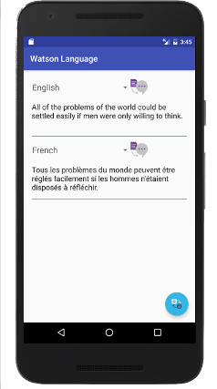

## Watson Language
Bluemix Mobile Starter for Watson Language in Java

### Table of Contents
* [Summary](#summary)
* [Requirements](#requirements)
* [Configuration](#configuration)
* [Run](#run)
* [License](#license)

### Summary
The Bluemix Mobile Starter for Watson Language showcases the Text To Speech and Language Translator services from Watson and gives you integration points for each of the Bluemix Mobile services.

### Requirements
* A [Bluemix](http://bluemix.net) Account
* [Android Studio](https://developer.android.com/studio/index.html) and [Gradle](https://gradle.org/gradle-download/)

### Configuration
* Open the project in Android Studio and perform a Gradle Sync.
* 2 required services were provisioned for you and their unique credentials were injected into your downloaded application, no further config required.

### Run
* You can now build and run the application from Android Studio!

The application allows you to do Language Translator and Text To Speech for multiple input and output languages. Choose your input language, type a message in the corresponding text box, and then click the text to speech or translation button.

### License 
This package contains code licensed under the Apache License, Version 2.0 (the "License"). You may obtain a copy of the License at http://www.apache.org/licenses/LICENSE-2.0 and may also view the License in the LICENSE file within this package.
