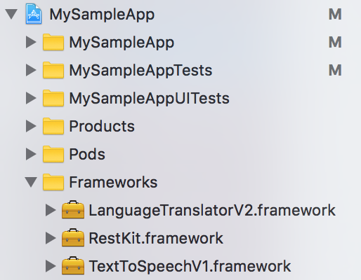
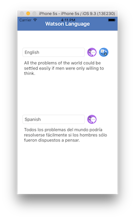
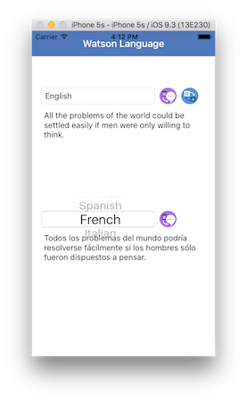
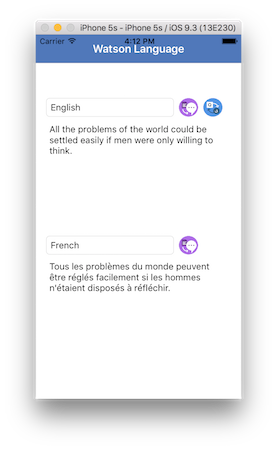

## Watson Language
Bluemix Mobile Starter for Watson Language in Swift

[](https://bluemix.net)
[](https://developer.apple.com/swift/)

### Table of Contents
* [Summary](#summary)
* [Requirements](#requirements)
* [Configuration](#configuration)
* [Run](#run)
* [License](#license)

### Summary
The Bluemix Mobile Starter for Watson Language will showcase the Text To Speech and Language Translator services from Watson and give you integration points for each of the Bluemix Mobile services.

### Requirements
* iOS 8.0+
* Xcode 9.0+
* Swift 3.2+ or Swift 4.0+

### Configuration
* [Bluemix Mobile services Dependency Mangagement](#bluemix-mobile-services-dependency-management)
* [Watson Dependency Management](#watson-dependency-management)
* [Watson Credential Mangement](#watson-credential-mangement)

#### Bluemix Mobile services Dependency Management
The Bluemix Mobile services SDK uses [CocoaPods](https://cocoapods.org/) to manage and configure dependencies. To use our latest SDKs you need version 1.1.0.rc.2.

You can install CocoaPods using the following command:

```bash
$ sudo gem install cocoapods --pre
```

If the CocoaPods repository is not confifgured, run the following command:

```bash
$ pod setup
```

For this starter, a pre-configured `Podfile` has been included in the **ios_swift/Podfile** location. To download and install the required dependencies, run the following command in the **ios_swift** directory:

```bash
$ pod install
```
Now Open the Xcode workspace: `{APP_Name}.xcworkspace`. From now on, open the `.xcworkspace` file becuase it contains all the dependencies and configurations.

If you run into any issues during the pod install, it is recommended to run a pod update by using the following commands:

```bash
$ pod update
$ pod install
```

> [View configuration](#configuration)

#### Watson Dependency Management
This starter uses the Watson Developer Cloud iOS SDK in order to use the Watson Text To Speech and Language Translator
services.

The Watson Developer Cloud iOS SDK uses [Carthage](https://github.com/Carthage/Carthage) to manage dependencies and build binary frameworks.

You can install Carthage with [Homebrew](http://brew.sh/):

```bash
$ brew update
$ brew install carthage
```

To use the Watson Developer Cloud iOS SDK in any of your applications, specify it in your `Cartfile`:

```
github "watson-developer-cloud/swift-sdk"
```

For this starter, a pre-configured `Cartfile` has been included in the **ios_swift/Cartfile** location

Run the following command to build the dependencies and frameworks:

```bash
$ carthage update --platform iOS
```

> **Note**: You may have to run `carthage update --platform iOS --no-use-binaries`, if the binary is a lower version than your current version of Swift.

Once the build has completed, the frameworks can be found in the **ios_swift/Carthage/Build/iOS/** folder. The Xcode project in this starter already includes framework links to the following frameworks in this directory:

* **LanguageTranslatorV2.framework**
* **RestKit.framework**
* **TextToSpeechV1.framework**



If you build your Carthage frameworks in a separate folder, you will have to drag-and-drop the above frameworks into your project and link them in order to run this starter successfully.

> [View configuration](#configuration)

#### Watson Credential Management
Once the dependencies have been built and configured for the Bluemix Mobile service SDKs as well as the Watson Developer Cloud SDK, no more configuration is needed. Both a Watson Language Translator and Text to Speech service have been provisioned for you and your unique credentials have been injected into the application.

> [View configuration](#configuration)

### Run
You can now run the application on a simulator or physical device:





The application allows you to do Language Translator and Text To Speech for multiple input and output languages. Choose your input language, type a message in the corresponding text box and then click the text to speech or translator button.


### License
This package contains code licensed under the Apache License, Version 2.0 (the "License"). You may obtain a copy of the License at http://www.apache.org/licenses/LICENSE-2.0 and may also view the License in the LICENSE file within this package.
